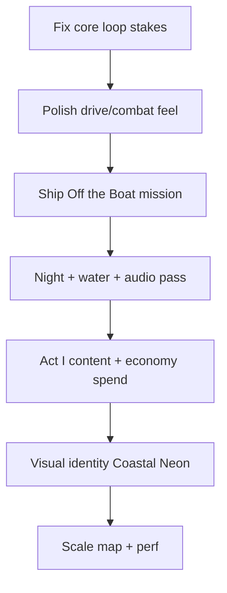

# The Narrows — Evaluation & Elevation Plan

## Where the game is today

The Narrows is past the “tech demo” stage and into a **playable open-world crime loop**, but it still reads more like a strong vertical slice than a finished game. Two builds exist:

| Build | Role | Maturity |
|-------|------|----------|
| **`QUAHOG_Web/`** | Reference spec + live deploy ([projectsouthcoast.vercel.app](https://projectsouthcoast.vercel.app)) | Most complete: missions, economy, heat, radio, streaming map, touch controls |
| **`QUAHOG_GODOT1/`** | Active ship target (Godot 4.6 Web/mobile) | Solid port: real OSM map, drive/fight/jobs, day/night, big map, cheats — but police are **off by default**, missions are thin, and polish gaps remain |

**What works well**

- Real South Coast geography (New Bedford → Fall River corridor)
- Core GTA loop: walk, steal cars, drive, shoot, earn cash, flee heat
- Touch controls + customizable HUD layout
- Day/night, rain, streetlights, radio, minimap, fast travel
- Web build has deeper systems (businesses, mission chain, safehouse, collectibles)

**What holds it back**

1. **Consequence is optional** — Godot defaults `cheat_no_police = true`, so the crime loop has no teeth unless the player finds cheats.
2. **Content depth** — delivery jobs exist; story missions, factions, and character beats from the bible are mostly unbuilt.
3. **World still feels procedural** — buildings are extruded blocks; hero landmarks, interiors, and set dressing are thin.
4. **Juice & audio gaps** — footsteps, horn, headlights, impact polish, district ambience.
5. **No single “north star”** — web and Godot diverge; improvements should land in web first, then port to Godot (per `plans/mount-hope.md`).

---

## Exactly what to do next (prioritized)

These are the highest-leverage moves, in order:

### Tier 1 — Make the loop feel like a real game

1. **Re-enable police/heat by default in Godot** — **DONE** (`cheat_no_police` default `false`; tuned decay/bust/cop damage)
2. **Complete the core crime loop polish** — **DONE**
   - Horn (button + SFX) — `H` + HORN touch button
   - Water as non-drivable barrier — `water_zones.gd` + `water_hazard.gd`
   - Health/armor pickups + cop damage tuning — pickups expanded; cop damage 6
   - Pay-n-Spray / heat clear — `respray_zone.gd` at gun-shop area ($200)
3. **Ship “Off the Boat” opener** — **DONE** (`story_mission.gd`; auto-starts on new game)
4. **Weapon variety on the street** — **DONE** (pistol/bat/shotgun/rifle + ammo pickups)
5. **Smoke-test checklist per build** — **DONE** (`plans/smoke-test-checklist.md`)

### Tier 2 — Make the world believable

6. **Water barrier + drivable bridges** — **DONE** (`water_zones.gd` bridge corridors; `map_loader.gd` deck colliders for Braga, hurricane barrier, Fairhaven).  
7. **Night readability** — **DONE** (facade window emission, car head/taillights, street lamps + mooring lights).  
8. **Traffic & ped life** — **DONE** (stop signs + traffic lights at junctions; ped panic on gunfire; TOD density scaling).  
9. **Hero landmarks** — **DONE** (Lizzie Borden House, Whaling Museum + Battleship Cove polish).  
10. **Audio pass** — **DONE** (harbor ambient loop; footsteps/screech/impacts already wired).

### Tier 3 — Make it memorable (content & identity)

11. **Act I missions** — **DONE** (Auction Rules, Linguiça Run, Harbor Heat in `story_mission.gd`).  
12. **Economy spend loop** — **DONE** (gun shop + Linguiça Linq diner interior with food purchases).  
13. **Coastal Neon style pass** — **DONE** (`neon_signs.gd`; TOD neon lamp energy in `game_world.gd`).  
14. **Radio milestone hooks** — **DONE** (`radio_hooks.gd` autoload; wanted/mission/rain barks).  
15. **Rebrand** — **DONE** (`The Narrows`, 2026 present-day; see `plans/the-narrows.md`).

### Tier 4 — Scale & performance

16. Godot: 200-car pool perf, streaming radius tuning, texture compression — **DONE** (quality presets, staggered car restream, building LOD, tile budget).  
17. Web: LOD/impostors for far buildings, object pooling, quality presets — **DONE** (`quality.ts`, far-tile impostors, pause-menu preset).  
18. Expand map: Brockton, Cape Cod, Dartmouth Mall hub — **DONE** (hero hubs, fast-travel, mall gun shop).

---

## Comprehensive improvement list

Everything possible, grouped by area. Items marked **[Web]** / **[Godot]** / **[Both]** where it matters.

---

### A. Gameplay & systems

| # | Improvement | Notes |
|---|-------------|-------|
| A1 | Re-enable police/wanted by default | **[Godot]** done |
| A2 | Tune wanted decay, bust fines, evade rewards | **[Godot]** done |
| A3 | Dual-axis heat (police + faction aggro) | **[Web]** has it; port **[Godot]** |
| A4 | Safehouse (sleep, save, clear heat) | **[Web]** partial |
| A5 | Pay-n-Spray / respray clears heat | **[Godot]** done |
| A6 | Mission framework: go-to, deliver, chase, escape, steal | **[Both]** partial |
| A7 | “Off the Boat” story opener | **[Godot]** done |
| A8 | Act I: Auction Rules, Linguiça Run, Harbor Heat | **[Godot]** done |
| A9 | Act II: Spindle City, Acquitted (Borden) | Content |
| A10 | Act III: Gloria storm, Battleship finale | Content |
| A11 | Delivery job polish (markers, payout UX, chains) | **[Both]** |
| A12 | Side activities: street races, boxing, boat smuggling | **[Both]** |
| A13 | Collectibles / photo-ops at landmarks | **[Web]** partial |
| A14 | Chop shop / weapons gated by progression | Design |
| A15 | Respect/reputation per faction | Design |
| A16 | Player upgrades (driving, shooting, health, stamina) | |
| A17 | Busted/wasted consequence screens | **[Web]** partial |
| A18 | Near-miss driving cash bonus | **[Web]** |
| A19 | Carjack traffic on foot | **[Web]** |
| A20 | Vehicle damage, smoke, explosions | **[Godot]** partial (body damage, impacts, smoke) |
| A21 | Ram traffic to stop / steal | **[Both]** |
| A22 | Pilotable boat / yacht | **[Web]** |
| A23 | Motorcycles, mopeds, bicycles | |
| A24 | Swimming / drown in open water | Barrier exists; swim TODO |
| A25 | Jump, crouch, vault, climb, cover | |
| A26 | Sprint stamina | **[Web]** |
| A27 | Lock-on / aim assist | |
| A28 | Melee combos, block, grapple | |
| A29 | Gun: reload, ammo pickups, weapon wheel | **[Godot]** partial (pickups) |
| A30 | Health regen, medkits, armor vests | **[Godot]** done |
| A31 | Businesses to buy (5 fronts) + passive income | **[Web]** |
| A32 | Revenue events (margin leak, boom) | **[Web]** |
| A33 | Shops: weapons, clothing, food, vehicle mods | |
| A34 | Bank, stash, bribes, fines | |
| A35 | Time-skip via sleep at safehouse | **[Web]** |
| A36 | Weather affects vehicle friction | |
| A37 | Cheat menu → settings/debug only in dev builds | **[Godot]** |

---

### B. Driving & vehicles

| # | Improvement | Status |
|---|-------------|--------|
| B1 | Per-model handling (sedan/taxi/SUV) | **[Godot]** done |
| B2 | Handbrake + drift feel | **[Both]** partial |
| B3 | Reverse/brake distinction | **[Godot]** done |
| B4 | Flip/recovery when overturned | **[Godot]** done |
| B5 | Chase cam behind car (not in front) | Fixed |
| B6 | Virtual joystick invert while driving | Fixed (PR #54) |
| B7 | Camera collision (no clip through buildings) | **[Godot]** done |
| B8 | Free-look orbit while driving | **[Godot]** done |
| B9 | Fast travel brings your car | **[Both]** done |
| B10 | Park cars at curb (not lane center) | **[Godot]** done |
| B11 | 200-car pool with restreaming | **[Godot]** done |
| B12 | Horn button + SFX | done |
| B13 | Headlights/taillights/brake/reverse/turn signals | Partial |
| B14 | Speedometer (MPH/km/h) | **[Both]** |
| B15 | Tire skid marks + screech audio | Partial |
| B16 | Engine RPM/audio layers | Partial |
| B17 | Wheel rotation + suspension animation | |
| B18 | Water non-drivable | done |
| B19 | Collision crunch + sparks | Partial |
| B20 | Car radio audible inside cabin | |
| B21 | Garage / storage / paint customization | |
| B22 | Region-accurate vehicle spawns (Townie, Linguiça moped, etc.) | |
| B23 | Traffic obeys lights, yields, honks | |
| B24 | Highway detailing: guardrails, gantries, lane paint | **[Godot]** partial |
| B25 | On/off ramps as distinct surfaces | |
| B26 | Zebra crosswalks | |

---

### C. World & map

| # | Improvement |
|---|-------------|
| C1 | Expand slice: full Fall River, Brockton, Cape Cod |
| C2 | Real building heights from OSM tags |
| C3 | Roof shapes (gable, mansard, sawtooth mills) |
| C4 | Façade variety: windows per floor, storefronts, brick/clapboard/granite |
| C5 | Sidewalks, curbs, crosswalks, stop bars |
| C6 | Land use: parks, beaches, parking lots, woodlands |
| C7 | Open-ocean water beyond rivers (Buzzards Bay) |
| C8 | Animated water (ripples, foam, sun glint) |
| C9 | Bridges: Braga truss, Fairhaven swing span, drivable decks |
| C10 | Hurricane Barrier across harbor mouth |
| C11 | Rail lines + level crossings |
| C12 | Islands, piers, buoys, lobster traps |
| C13 | Hero landmarks: Bethel, Whaling Museum, Borden House, USS Massachusetts |
| C14 | Street-name signs (3D + big map labels) |
| C15 | District labels (South End, Flint, etc.) |
| C16 | Enterable interiors: chapel, bar, gym, safehouse |
| C17 | Dartmouth Mall as mission hub |
| C18 | Satellite ground drape (Google Static Maps on Vercel) |
| C19 | POI/landmark dataset expansion |
| C20 | “Gloria” hurricane flood set-piece |
| C21 | LOD + impostors for distant buildings |
| C22 | Streaming tile budget tuning |
| C23 | Navmesh / road graph for AI routing |

---

### D. Graphics, lighting & atmosphere

| # | Improvement |
|---|-------------|
| D1 | Coastal Neon dusk look (style guide, 2026) |
| D2 | Smooth day/night sky transitions |
| D3 | Night window emission (per-window masks) |
| D4 | Neon/shop signs as light sources |
| D5 | Street lamp point lights at night |
| D6 | Vehicle lights as real lights |
| D7 | Police emergency flashers |
| D8 | Rain: puddles, wet roads, droplets on screen |
| D9 | Fog volumes (coastal dense fog) |
| D10 | Nor’easter: wind, lightning, thunder |
| D11 | Snow/sleet variant |
| D12 | Wind sways trees, flags, signs |
| D13 | Bloom, vignette, film grain, chromatic aberration |
| D14 | SSAO / wet-road reflections |
| D15 | God rays / volumetric light |
| D16 | Color LUT per district/weather |
| D17 | Material weathering: rust, salt stain, peeling paint |
| D18 | Decals: graffiti, posters, tire marks, blood (toggle) |
| D19 | Distant skyline + atmospheric haze |
| D20 | Per-time-of-day colour grade |
| D21 | Shadow cascade tuning |
| D22 | Vertex AO on buildings (compat-safe) |
| D23 | Façade UV = one window row per floor |
| D24 | Rooftop detail: AC units, parapets, water tanks |
| D25 | Trees/vegetation in parks & wooded overlays |
| D26 | Beaches: sand + waterline blend |

---

### E. Characters, NPCs & AI

| # | Improvement |
|---|-------------|
| E1 | Multiple ped models + wardrobe variety |
| E2 | Animation states: idle, walk, run, sprint, enter car, punch, aim, death |
| E3 | Foot IK on slopes/stairs |
| E4 | Ragdoll on death/knockdown |
| E5 | Named character models (Vinny, Sully, Conceição, etc.) |
| E6 | Ped AI: flee, panic, cower, converse |
| E7 | Ped density by district + time of day |
| E8 | Traffic: lanes, stop at lights, collision avoidance |
| E9 | Faction NPCs + turf spawns |
| E10 | Police: chase, shoot, take cover, flank, backup escalation |
| E11 | NPC daily schedules |
| E12 | Pedestrian barks / dialect engine |
| E13 | Facial animation / lipsync for cutscenes |
| E14 | Wet/dirty clothing states |
| E15 | Instanced/pooled crowds for performance |

---

### F. Audio & radio

| # | Improvement |
|---|-------------|
| F1 | 4 radio stations with music + DJ banter |
| F2 | Station IDs, ad reads, news/weather segments |
| F3 | Radio reacts to wanted level, missions, weather |
| F4 | More stations + larger music library |
| F5 | VO pipeline for NPC/mission dialogue (TTS → recorded later) |
| F6 | Adaptive mission music (calm/tension/chase) |
| F7 | Per-district ambient beds (harbor, mills, downtown) |
| F8 | Time-of-day ambience |
| F9 | Weather audio (rain, wind, thunder, foghorn) |
| F10 | Surface-aware footsteps |
| F11 | Weapon/impact audio polish |
| F12 | 3D spatialization + reverb zones |
| F13 | Doppler on passing vehicles |
| F14 | UI SFX (menu, cash, wanted-up, mission complete) |
| F15 | Ocean/wave ambient at waterfront |

---

### G. UI / UX / accessibility

| # | Improvement |
|---|-------------|
| G1 | HUD: health, armor, ammo, cash, wanted, clock, objective |
| G2 | Minimap with heading, cops, jobs, district name |
| G3 | Big map: pan/zoom, fast travel, waypoints, legend |
| G4 | Touch controls: joystick + draggable/resizable buttons |
| G5 | Speedometer while driving |
| G6 | Interaction prompts (E enter, B buy, etc.) |
| G7 | Toast notifications |
| G8 | Pause menu + settings (volume, shadows, effects) |
| G9 | Main menu: New / Continue / Load / Settings |
| G10 | Multiple save slots |
| G11 | Controls reference screen |
| G12 | Coastal Neon UI theme (Courier, neon palette) |
| G13 | Subtitles + dialogue UI |
| G14 | Weapon wheel / inventory UI |
| G15 | Character/outfit menu |
| G16 | Photo mode |
| G17 | Gamepad support + remappable controls |
| G18 | Invert look / invert steering options |
| G19 | Colorblind modes, UI scale, high contrast |
| G20 | Reduce motion / camera-shake toggle |
| G21 | First-time tutorial / onboarding |
| G22 | Build stamp (commit hash, date) in HUD |
| G23 | Error boundary + crash overlay |
| G24 | Debug FPS/telemetry overlay (`?debug`) |
| G25 | Loading screen with progress + lore tips |
| G26 | Credits / legal / OSM attribution |

---

### H. Camera & game feel

| # | Improvement |
|---|-------------|
| H1 | Third-person chase + first-person toggle |
| H2 | Collision-aware camera + occlusion fade |
| H3 | Aim/over-shoulder camera |
| H4 | Cinematic cutscene camera rig |
| H5 | FOV scales with vehicle speed |
| H6 | Camera shake: impacts, gunfire, explosions |
| H7 | Hit-stop / slow-mo finishers |
| H8 | Impact particles (sparks, dust, debris) |
| H9 | Pickup/cash pop FX |
| H10 | Foot dust, splash decals |
| H11 | Damage vignette + directional hit indicators |
| H12 | Controller rumble / haptics |

---

### I. Tech, performance & ops

| # | Improvement |
|---|-------------|
| I1 | Godot Web export CI on every PR |
| I2 | Web CI: `tsc && vite build` |
| I3 | Smoke-test checklist (manual + scripted) |
| I4 | Cross-browser testing (Chrome, Safari, mobile) |
| I5 | Streaming radius + per-frame build budget |
| I6 | 200-car pool dormancy/instancing perf pass |
| I7 | Web VRAM / texture compression tuning |
| I8 | Quality presets + dynamic resolution |
| I9 | Bundle code-splitting + lazy routes |
| I10 | Object pooling (peds, cars, particles) |
| I11 | On-screen error/telemetry for web debugging |
| I12 | Faster first paint / loading progress |
| I13 | In-browser mission/world editor (devkit) |
| I14 | Hot-reload mission JSON |
| I15 | Asset budget validation tooling |
| I16 | Changelog + release notes |
| I17 | Desktop wrap (Tauri/Electron) — stretch |
| I18 | Photoreal Google 3D Tiles build — blocked on API key |
| I19 | Unreal PC/console track (`MountHope_Unreal/`) — separate product |

---

### J. Content, story & world-building

| # | Improvement |
|---|-------------|
| J1 | Characters & Missions bible → implemented beats |
| J2 | Faction turfs: Azorean Syndicate, South End Crew, Cape Set |
| J3 | Environmental storytelling: graffiti, murals, posters, newspapers |
| J4 | Memorials/plaques at real landmarks |
| J5 | Feast of the Blessed Sacrament banners |
| J6 | Cutscene system (camera + dialogue + subtitles) |
| J7 | Branching mission outcomes |
| J8 | Dialogue choices where relevant |
| J9 | Vinny progression: deckhand → made man → harbor kingpin |
| J10 | Romance/loyalty thread (Marisol) |
| J11 | Boxing circuit (Iron Mike, Brockton) |
| J12 | Lizzie Borden ghost-tour caper |
| J13 | Fake Kennedys Cape grift storyline |

---

### K. Branding & product

| # | Improvement |
|---|-------------|
| K1 | Rebrand: The Narrows (UI done; repo rename optional) |
| K2 | Consistent domain/branding |
| K3 | Pitch materials aligned with playable build |
| K4 | STYLE_GUIDE.md enforced in assets |
| K5 | Legal parody disclaimer prominent |
| K6 | OSM attribution in-game |

---

## Recommended execution order

**If you only do five things:**

1. Turn police back on (Godot) and tune heat  
2. Finish “Off the Boat” as the default new-game path  
3. Water barrier + horn + headlights (world reads as a place)  
4. Weapon variety + shops (give cash a purpose)  
5. One focused audio/FX pass (footsteps, screech, harbor ambience)

That sequence turns “impressive sandbox” into “game I’d show someone and they’d understand what The Narrows is.”

---

## Related docs

- `plans/mount-hope.md` — master plan & running log (Godot port target spec)
- `plans/roadmap-50.md` — next 50 curated tasks
- `plans/the-narrows.md` — title, era (2026), brand stack
- `quahog-project-files/CHARACTERS_AND_MISSIONS.md` — story bible
- `quahog-project-files/STYLE_GUIDE.md` — visual direction
- `QUAHOG_Web/ROADMAP.md` — photoreal build stability & phases
